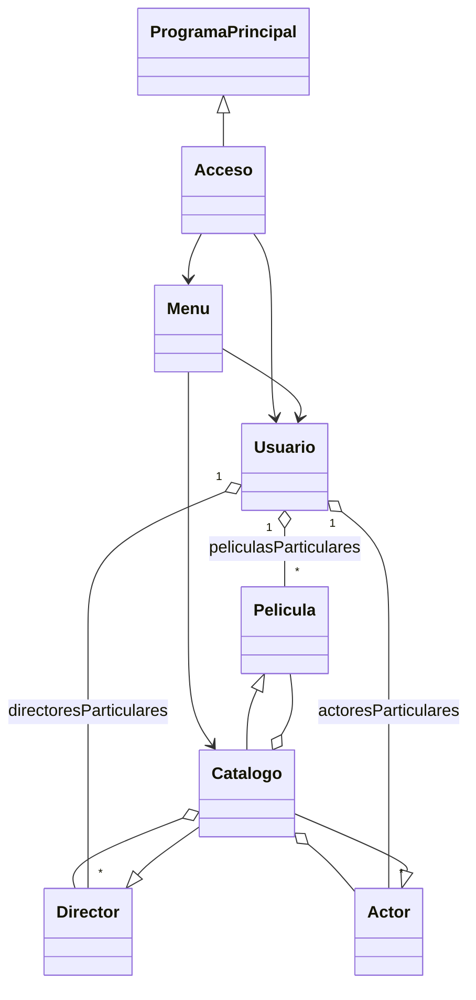

# Proyecto Final · Gestión de Películas (1º DAW)

Resumen del proyecto: aplicación de consola en Java para gestionar un pequeño catálogo de películas, actores y directores, con soporte de usuarios y listas personales.

---

## Descripción

La aplicación permite:

- Gestionar catálogos de películas, actores y directores.
- Registrar e iniciar sesión con usuarios (roles: usuario y administrador).
- Crear y mantener listas personales basadas en la lista general.
- Persistir datos en ficheros para mantener estado entre ejecuciones.

La interfaz es por consola (menús) y los datos se almacenan en ficheros binarios/serializados en el directorio del proyecto.

---

## Organización del Trabajo

Trabajo en equipo con control de versiones en GitHub. Cada miembro puede encargarse de módulos separados (modelo, persistencia, interfaz y utilidades).

---

## Objetivos

- Aplicar conceptos de programación orientada a objetos.
- Diseñar clases y paquetes coherentes y reutilizables.
- Gestionar persistencia sencilla mediante serialización de objetos.
- Practicar colaboración con Git/GitHub.

---

## Estructura del Código

Paquetes principales:

- `com.projecte.main` — Punto de entrada (`ProgramaPrincipal`).
- `com.projecte.marc` — Gestión de acceso, usuarios y lógica de negocio relacionada con usuarios.
- `com.projecte.pablo` — Modelos de dominio: `Pelicula`, `Actor`, `Director`, `Catalogo`.
- `com.projecte.utils` — Utilidades compartidas (excepciones, filtros, comparadores, interfaces).

Diagrama UML del proyecto:

Ficheros de datos y carpetas relevantes:

- `usuarios.llista` — fichero principal con usuarios serializados.
- `datos/` — listados y datos iniciales (`peliculas.datos`, `actores.datos`, `directores.datos`).
- Carpetas por usuario (`<id>-<correo>/`) que contienen `peliculas.lista`, `actores.lista`, `directores.lista`.

---

## Funcionamiento básico

Al iniciar la aplicación aparece un menú de acceso con dos opciones: iniciar sesión o registrarse. Una vez autenticado, el usuario entra en el menú principal, desde donde puede acceder a todas las funcionalidades del sistema.

Control de permisos:

- Usuarios normales: consultar el catálogo y gestionar sus listas personales.
- Administradores: además pueden añadir y eliminar elementos en el catálogo general y gestionar usuarios.

El usuario puede consultar los catálogos generales de películas, directores y actores. Las películas se pueden ordenar con los siguientes criterios:

- por título,
- por duración,
- por año y título,
- por filtro, eligiendo una duración y un género para mostrar solo las películas que cumplan ambos requisitos.

El menú principal también permite añadir nuevos elementos al catálogo general: película, director o actor. Esta acción solo está disponible para administradores; un usuario normal no puede añadir elementos.

La aplicación permite construir listas particulares a partir del catálogo general. El usuario puede seleccionar una película, un director o un actor y añadirlo a su propia lista personal.

También hay una opción para eliminar elementos. El usuario puede elegir si desea borrar el elemento de la lista general o solo de su lista particular. Si se elimina de la lista general, el elemento desaparece de todas las listas particulares que lo contengan. Si se elimina solo de la lista particular, sigue existiendo en el catálogo general.

Por último, el usuario puede consultar sus listas particulares. Esta opción funciona de forma similar a la consulta del catálogo general, pero muestra únicamente los elementos guardados en su propio perfil.

---

## Listas

### Lista general

Catálogo compartido con todos los elementos disponibles. Se modifica por usuarios con permisos de administrador.

### Listas personales

Cada usuario puede mantener listas derivadas de la lista general; las listas se guardan en ficheros personales para persistencia.

---

## Tecnologías

- Java 8+ (se usan paquetes y serialización)
- Git / GitHub

---

## Notas importantes

- Los datos se guardan en ficheros binarios; respeta la estructura de paquetes al recompilar.
- Si se producen cambios en las clases serializables, los ficheros existentes pueden volverse incompatibles.
- Para pruebas rápidas puedes eliminar/renombrar `usuarios.llista` para forzar la creación de un administrador por defecto.

---

